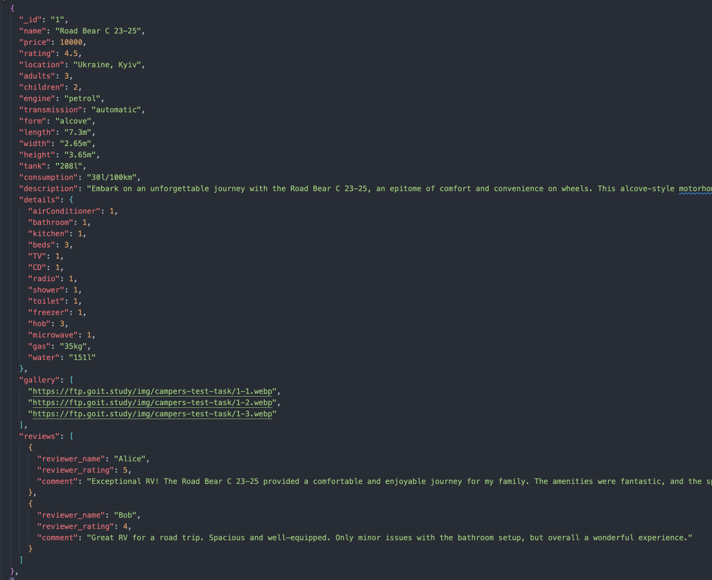
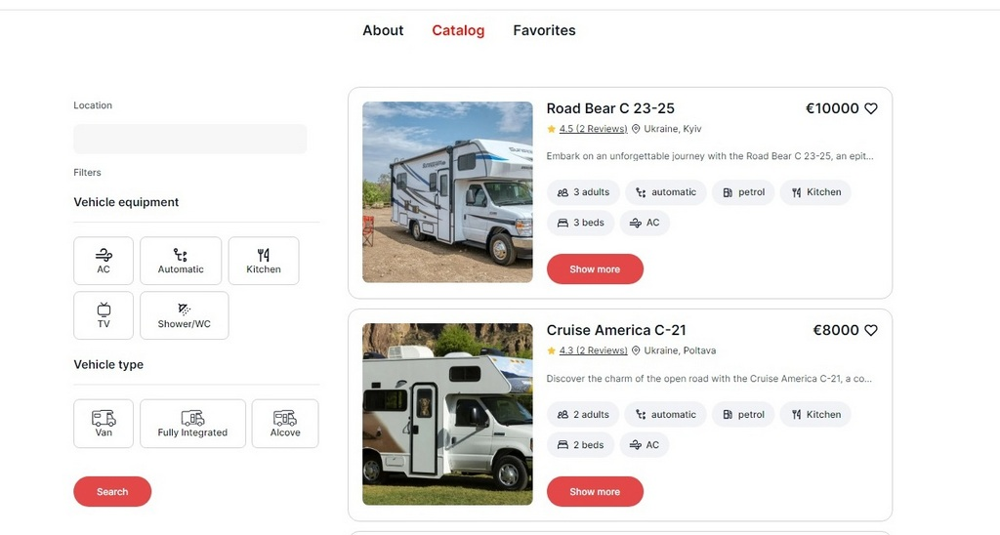
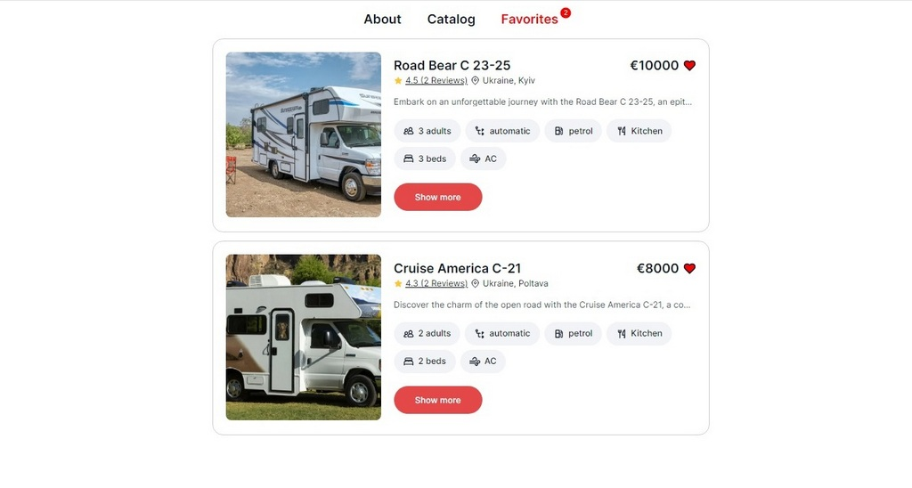
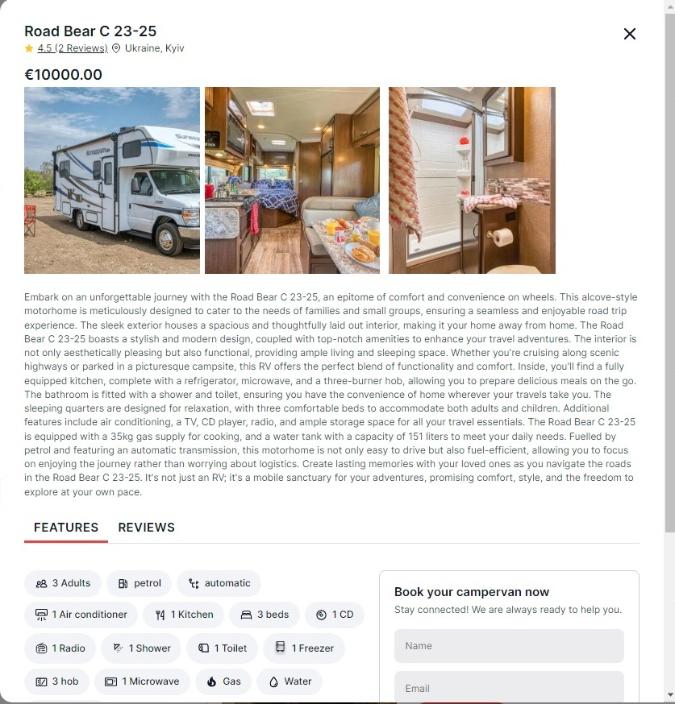

# Тестове завдання

## Ваше завдання - створити застосунок для компанії, що надає послуги надання в Україні камперів в оренду.

Застосунок складається з 3-х сторінок:

1. Домашня сторінка з загальним описом послуг, що надає компанія. Стилізація та оформлення на ваш розсуд.
2. Сторінка, що містить каталог камперів різної комплектації, які користувач може фільтрувати за місцем знаходження, обладнанням та типом
3. Сторінка з оголошеннями, які були додані користувачем в улюблені

Зовнішній вигляд програми повинен складатися з навігації (оформлення на ваш розсуд) та області перегляду.

## Технічне завдання

1. Відповідно до макету реалізувати картку оголошення про здачу кампера в оренду.
2. На першій сторінці каталогу має рендеритися 4 оголошення, а їх решта - по кліку на кнопку Load more.
3. У разі кліку по кнопці у вигляді “серця” на картці оголошення воно має додаватися до списку улюблених, а колір кнопки змінюватися.
4. При оновленні сторінки має фіксуватись кінцевий результат дій користувача. Тобто, якщо додати оголошення в улюблені та оновити сторінку - то кнопка все одно залишається в стані “улюбленого оголошення” із відповідним кольором.
5. У разі повторного кліку по кнопці у вигляді “серця” оголошення повинно бути видалене зі списку улюблених, а колір кнопки змінитись до початкового стану.
6. У разі кліку по кнопці Show more має відкриватись модальне вікно з детальною інформацією про кампер.
7. Модальне вікно повинно закриватись по кліку на кнопку у вигляді “хрестика”, по кліку на backdrop та натисканню на клавішу Esc.
8. В модальному вікні міститься інформація щодо особливостей кампера і відгуків про нього. Відмалювання інформації має залежати від стану активної таби.
9. В модальному вікні також міститься форма для оформлення бронювання камперу, що складається з полів name, email, booking date і comment. Поля name, email, booking date є обовʼязковими до заповнення і мають проходити перевірку на валідність введених значень.(У випадку невалідних даних форма не відправляється, у випадку валідної форми - сторінка оновлюється).
10. Ціна оренди має бути прописана одним значенням (наприклад, 8000). В UI - виведено через кому (8000,00).

Для роботи зі списком оголошень створiть свій персональний бекенд для розробки за допомогою UI-сервісу https://mockapi.io/. Створiть ресурс adverts. Використайте конструктор ресурсу та опишiть об'єкт оголошення згiдно опису нижче.

## Advert

1. Створіть advert в Mockapi з наступними полями: \_id, name, price, rating, location, adults, children, engine, transmission, form, length, width, height, tank, consumption, description, details, gallery, reviews (див. скріншот нижче). Для наповнення колекції можна взяти adverts.json

2. Зображення камперу можете підібрати самостійно.
3. В базі має бути від 13 оголошень з різними значеннями (на ваш розсуд). Реалізована пагінація, де одна сторінка пагінації повинна вміщувати 4 оголошення.

## Створiть маршрутизацію, використовуючи React Router

У застосунку повинні бути такі маршрути:

“/” - домашня сторінка з загальним описом послуг, що надає компанія
“/catalog” - сторінка, що містить каталог камперів різної комплектації
“/favorites” - сторінка з оголошеннями(оформлення на ваш розсуд), які були додані користувачем в улюблені
Якщо користувач зайшов за маршрутом, якого не існує, його необхідно перенаправляти на домашню сторінку.

## Додаткове завдання

### Додайте фільтрацію:

Текстовий input, за наявності значення якого користувачеві слід показати оголошення з камперами, що знаходяться у відповідній локації
Чекбокси з відповідним обладнанням - показати оголошення з камперами, що містять обране обладнання
Радіо-кнопки з типами камперів - показати оголошення з камперами, що належать до відповідного типу

## Критерії виконання

- Верстка фіксована в рх, семантична та валідна
- Немає помилок в консолі браузера
- Обов’язкове використання Redux
- Для запитів використовується бібліотека Axios
- Робота виконана на нативному JS з використанням бандлеру (Vite, Parcel або ін.) або на React
- Інтерактивність працює відповідно до технічного завдання
- Код відформатований та без коментарів
- В репозиторії має бути описаний README.md
- Проєкт задеплоєний на github pages або netlify.com

## Формат оцінювання:

Оцінка від 0 до 100

## Формат здачi:

- Два посилання: на вихідні файли і робочу сторінку на GitHub Pages або netlify.com
- Прикрiплений файл репозиторію у форматi zip

# Vehicle rent service

Цей проект було запущено за допомогою програми [Create React App](https://github.com/facebook/create-react-app).

## Доступні скрипти

У каталозі проекту ви можете запустити:

### `npm start`

Запускає програму в режимі розробки.
Відкрийте http://localhost:3000, щоб переглянути його у своєму браузері.

Сторінка перезавантажиться, коли ви внесете зміни.
Ви також можете побачити помилки у консолі.

### `npm test`

Запускає програму в тестовому режимі.

### `npm run build`

Збирає програму для в папку збірки.
Він правильно поєднує React у робочому режимі та оптимізує збірку для найкращої продуктивності.

Збірку мінімізовано, а імена файлів містять хеші.
Ваш додаток готовий до розгортання!

## Зворотній зв'язок

Ви можете зв'язатися зі мною за допомогою e-mail jure@ua.fm

###

###

###

